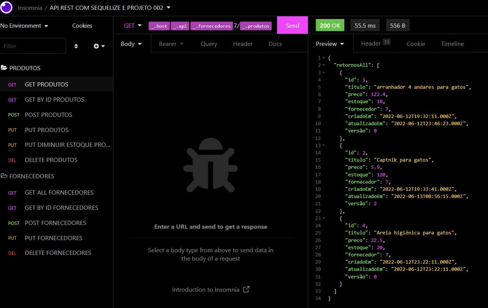

# :infinity: API REST PETSHOP.
___

## SOBRE

Esta api Realiza requisições do tipo <mark>GET POST PUT DELETE</mark> do tradicional <mark>CRUD</mark>.

Com objetivos de retornar detalhes sobre fornecedores de "Ração" e "brinquedos", além de conter rotas próprias para requisição de serviços para Produtos que estão relacionados a chaves do fornecedores.

Para o desenvoldimento deta API foram ultilizados práticas modernas de modelo REST com SEQUELIZE e EXPRESS tornando a API escalonável para futuros desenvolvimentos de projetos ou agregação de futuras listas de fornecedores ou produtos.

___

### DETALHES ROTAS FORNECEDORES

O processo desta API é desenvolvida conforme o fluxo abaixo, o usuário podera fazer requisições para listar fornecedores, buscar fornecedores pelos seus respectivos ID, criar novos Fornecedores no banco do dados, editar antigas informações de Fornenceres por novas ou Deletar os dados de um Fornecedor usando seu ID.

A Api faz uma verificação dos dados recebidos e casos o mesmos não sejam nos formatos desejados então será retornado um error informado que somente o tipo de dados como JSON serão aceitos para requisição.

___

#### REQUISIÇÕES ROTAS FORNECEDORES:

Nesta API o usuário poderá fazer até 4 tipos de requisições no front-end
sendo elas:

HTTP  | verbo         | tipo do botão             | rota                              |
------|---------------|---------------------------|-----------------------------------|
GET   | Listar        |Listas Fornecedores        | http://<rota>/api/fornecedores    |
GET   | Listar        |Listar Fornecedor   por id | http://<rota>/api/fornecedores/:id|
POST  | Criar         |Criar Fornecedor           | http://<rota>/api/fornecedores    |
PUT   | Editar        |Edita Fornecedor           | http://<rota>/api/fornecedores/:id|
DELETE| Deleta        |Delta Fornecedor           | http://<rota>/api/fornecedores/:id|

___

##### GET FORNECEDORES

O method GET fornecedores retorna todos forncedores que estão na base do banco de dados MySql, ao ir na rota teremos os seguintes dados dos forncedores como rotorno.

id, empresa, email, categorias, criadoEm, AtualizadoEm, versão

BANCO DE DADOS:

RETORNO NO INSONMIA.

##### GET POR ID FORNECEDORES

Methodo que retorna todos dados de um único forncedor somente pelo id informado no params da URL.

##### POST FORNECEDORES

Metodo que adiciona um novo fornecedor para a lista de fornecedores.

##### PUT FORNECEDORES

Metodo que busca pelo Id um determinado fornecedor e então corrigi os dados do mesmos para os dados novos que forem informado no body da requisição.

##### DELETE POR ID FORNECEDORES

metodo que deleta um fornecedor da lista quando informado o id do mesmo no params da url.

____

#### FLUXOGRAMA DO FLUXO DE REQUISIÇÕES PARA FORNECEDORES:

#### METODOS E ROTAS DE FLUXOS PARA REQUISIÇÔES:

Conforme a imagem abaixo, fica destado os metodos permitidos para requisições na rota fornecedore e suas urls.

### REQUISÕES PARA PRODUTOS

Esta rota está associada diretamente a rota fornecedos, cada fornecedor possui lista de produtos que está associado ao seu ID pela FOREIGN KEY.
nas rotas são associadas a rotas informadas acimas com os seguites retornos.

No exemplo acima é uma requisição para o metodo GET na api retornando todos produtos que estão associados ao fornecedor cadastrado de id 7, caso não encontre nenhum fornecedor com este ID a API retorna error informando que o fornecedor não existe no banco de dados e desta maneira não há produtos associados ao mesmo.

### METODOS E ROTAS DE FLUXOS PARA REQUISIÇÔES EM PRODUTOS

